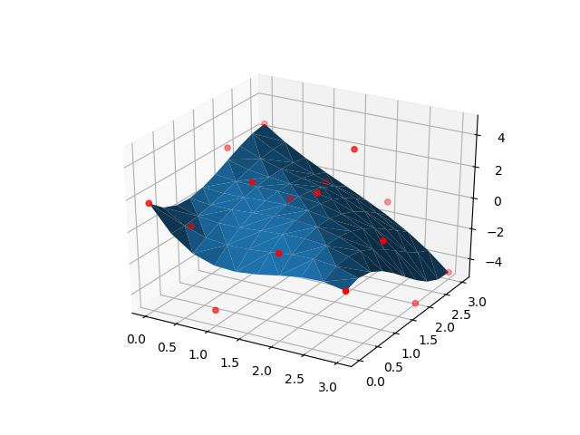
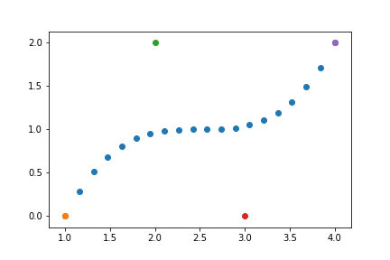

# Bézier Curves and Surfaces
This repository contains two jupyter notebooks demonstrating Bézier curves and surfaces. 

Subjects covered: 

* Bézier curve recursive and explicit definition
* Bézier surface explicit definition
* Uniform sampling of a Bézier curve
* Rotation by rotating control points

### Surface

### Curve

